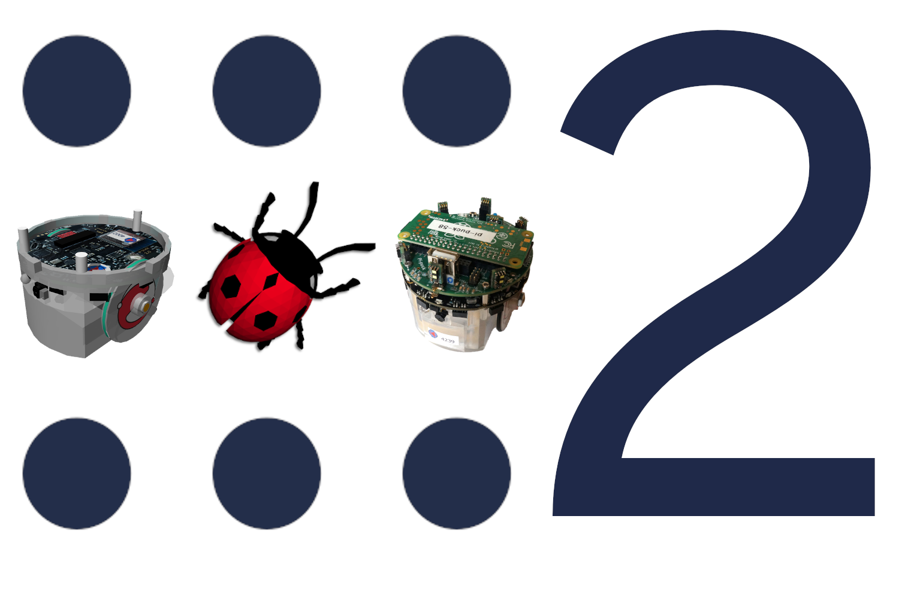

# ROS2 Programming Interface for the E-puck2 Robot

  

This is a report for my master's project about [ROS2](https://index.ros.org/doc/ros2/) programming interface for the [e-puck2 robot](https://www.gctronic.com/doc/index.php/e-puck2).

> This project's motivation is to close the loop between the simulation and the physical world in a robotics application and allow an effortless algorithm transfer from a robot to a robot in general.
The project aims to utilize ROS2, the second iteration of a popular robotics framework, to develop a standard interface for e-puck2 physical and simulated robots and many other simulated robots.

## Code

The code for this project is available across multiple repositories:
- [cyberbotics/epuck_ros2](https://github.com/cyberbotics/epuck_ros2): ROS2 interface for the physical robot, the main contributor ([PRs](https://github.com/cyberbotics/epuck_ros2/pulls?q=is%3Apr+author%3Alukicdarkoo+is%3Aclosed+closed%3A%3C2020-08-14), [graph](https://github.com/cyberbotics/epuck_ros2/graphs/contributors?from=2020-02-17&to=2020-08-14)).
- [cyberbotics/webots_ros2](https://github.com/cyberbotics/webots_ros2): ROS2 interface for simulated robots, introduced automatic ROSification ([PRs](https://github.com/cyberbotics/webots_ros2/pulls?q=is%3Apr+author%3Alukicdarkoo+is%3Aclosed+closed%3A%3C2020-08-14), [graph](https://github.com/cyberbotics/webots_ros2/graphs/contributors?from=2020-02-17&to=2020-08-14)).
- [cyberbotics/webots](https://github.com/cyberbotics/webots): Introduced improvements to Webots core needed for automatic ROSification ([PRs](https://github.com/cyberbotics/webots/pulls?q=is%3Apr+author%3Alukicdarkoo+is%3Aclosed+closed%3A%3C2020-08-14), [graph](https://github.com/cyberbotics/webots/graphs/contributors?from=2020-02-17&to=2020-08-14))
- [lukicdarkoo/epuck-ros2-various-analyses](https://github.com/lukicdarkoo/epuck-ros2-various-analyses): Data analysis, benchmarks, camera calibration and similar.
